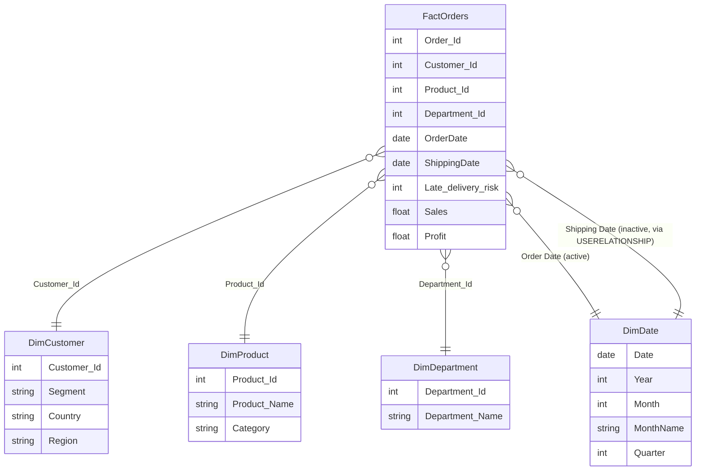

# Data Model — Star Schema

GitHub renders Mermaid diagrams natively, so this will display as a diagram directly on the repo page.

## Why dual date relationships?

Orders need to be analyzed on two different timelines — when they were **placed** (Order Date) and when they were **shipped** (Shipping Date). Power BI only allows one *active* relationship between two tables at a time, so:

- The relationship on **Order Date** is active by default (used in most measures).
- The relationship on **Shipping Date** is kept inactive and activated inside specific DAX measures using `USERELATIONSHIP()`, e.g. `Orders Shipped (by Ship Date)`.

This avoids duplicating the fact table or the date table just to support two timelines.
